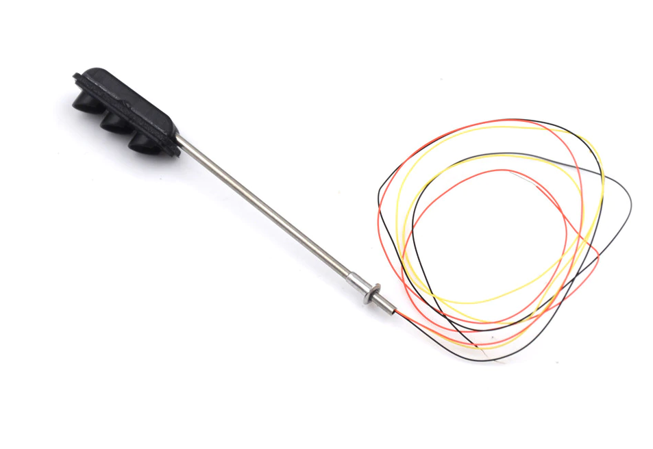
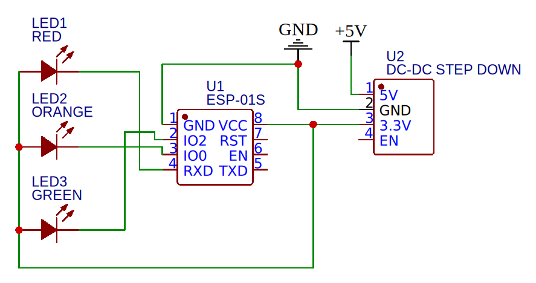
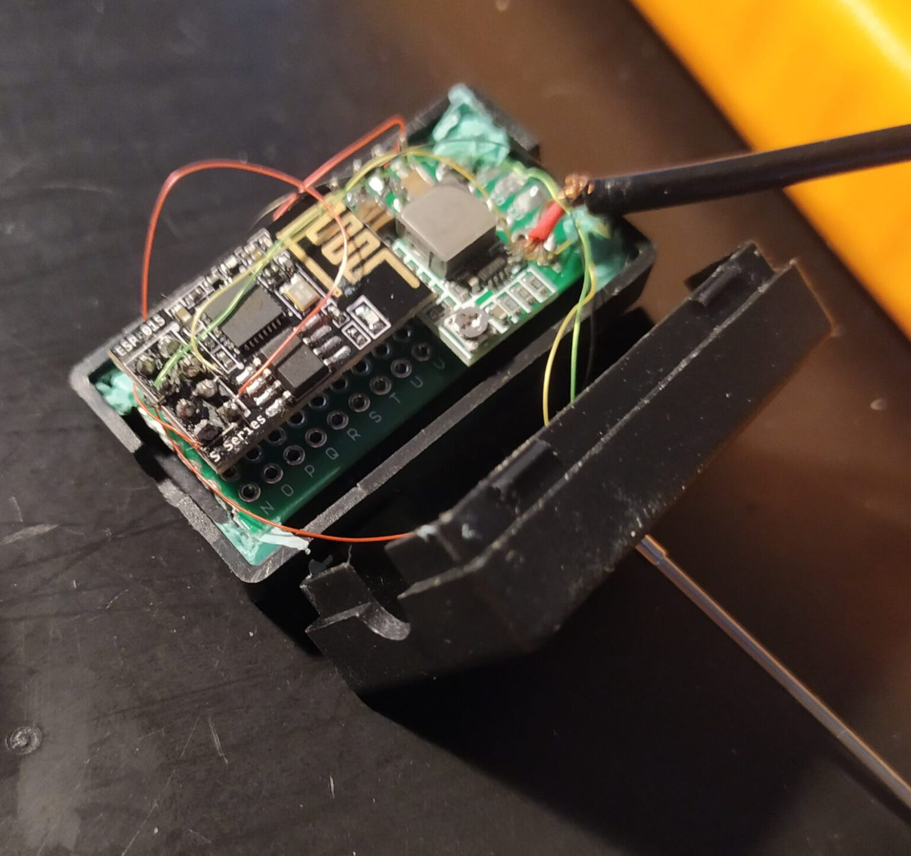
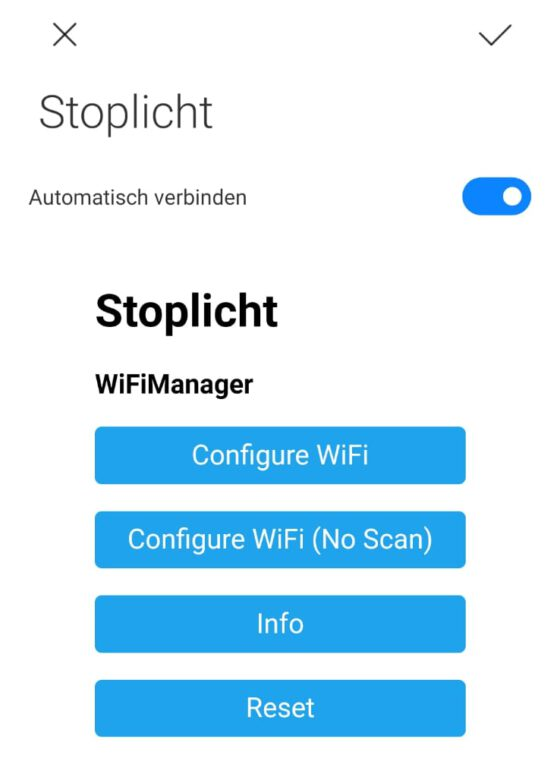

![[traffic-light-2.png]]
In my [previous blogpost](traffic-light-1)  we set up an IoT network to hook our smart traffic light up to. In this post we will create our first prototype! We are going to create a miniature version of our internet enabled traffic light. These are the parts I used:

- 1x [Miniature Traffic Light](https://nl.aliexpress.com/item/32956703187.html)
- 1x [ESP-01s](https://nl.aliexpress.com/item/32948119527.html)
- 1x [Power Cable with Switch](https://nl.aliexpress.com/item/32817721226.html)
- 1x [5V to 3.3V Stepdown Converter](https://nl.aliexpress.com/item/32880983608.html)
- 1x [Plastic Case (48 * 26 * 15 mm)](https://nl.aliexpress.com/item/32812420460.html)

In order to program the ESP-01s you also need an [adapter](https://nl.aliexpress.com/item/32799975353.html). It is also possible to use whatever microcontroller with a connection to the internet. I chose the ESP-01 because they're inexpensive, fit to do the job (I even have an unused GPIO pin) and above all they're really small.

# Power

How do we power our traffic light? Our micocontroller runs on 3.3V. Luckily, the LED's on our miniature traffic light also run without anny hassle on this voltage, so there is no need for resistors. These LED's can be directly powered by the ESP-01 as they consume very little power.

I wanted the whole thing to be powered through a USB cable. Phone chargers and USB ports produce 5V so we need to step that down to 3.3V. I used a small DC-DC buck converter I had lying around. Most converters will be able to do the job, as the whole circuit will only consume ~250mA at max.[^1]
# Traffic Light

There it is, all the way from China! This is a common cathode circuit, which means that the shared wire (the black one) has the positive polarity (+3.3V). The GPIOs now function as a _sink_: when a pin is pulled down to 0V, a current will flow through the LED to the pin. It may be a bit counterintuitive at first, but when we pull a pin LOW, the LED will turn on.

<figure>
  
  <figcaption><center><small>Fig 1. Miniature Traffic Light.</center></small></figcaption>
</figure>

# Assembly

I drilled a hole in the plastic for the traffic light to fit in and its wires to go through. Then I soldered all the components on a piece of perf board according to the diagram in Figure 2. Note that the wire of the LEDs are extremely thin. You can solder them directly onto the ESP-01. That won't be a problem when programming the board.

<figure>
  
  <figcaption><center><small>Fig 2. Wiring diagram.</center></small></figcaption>
</figure>

It doesn't really matter to which of the four GPIO's (IO0, IO2, RXD, TXD) you connect which LED. This can all be adjusted later programmatically anyway.

I didn't make it easy for myself by choosing such a small plastic case. It can be really hard to fit all components in. I used bits of kneading glue to sort of fix the board and the traffic light to the case.

<figure>
  
  <figcaption><center><small>Fig 3. Inside the Traffic Light.</center></small></figcaption>
</figure>

In Figure 3 you can see all of the components wired up together. The USB-cable in this picture looks a bit loose. That's the case because I took this photo while repairing that connection.

# Software
Now it's time to write some code! The traffic light should:

1. Connect to your WiFi;
2. Connect to the specified MQTT server;
3. Publish its status (online/offline) in the topic `connection/mini-stoplicht`;
4. Subscribe to the topic `vvb/status`;
5. Adapt to changes in `vvb/status`;
6. ?????
7. Profit

## Control the lights

How to control the lights programmatically? Well, since it's a common cathode circuit, we'll have to turn the pins to 0V for our LEDs to turn on. You first have to declare the pins and then set them to OUTPUT to be able to control them. The setup method will be called _once_ upon start.

```c
// According to our wiring diagram
const int PIN_RED = 3;
const int PIN_ORANGE = 0;
const int PIN_GREEN = 2;

void setup {
  pinMode(PIN_GREEN, OUTPUT);
  pinMode(PIN_ORANGE, OUTPUT);
  pinMode(PIN_RED, OUTPUT);
}
```

Now turning an LED on or off goes like this:

```c
digitalWrite(PIN_RED, LOW);    // Turn ON
digitalWrite(PIN_RED, HIGH);   // Turn OFF
```

## WiFi Connection

Establishing a WiFi connection is one of the most essential features of this device. I didn't want to reprogram it for whatever journey I took it with. The traffic light should work on every network, so hardcoding the WiFi credentials was out of the question. Luckily, there exists a library to handle this exact problem: [WiFiManager](https://github.com/tzapu/WiFiManager). That works with the standard [ESP8266WiFi library](https://github.com/esp8266/Arduino/tree/master/libraries/ESP8266WiFi).

WiFiManager sets up an access point with a captive portal (see Figure 4) where you can select your network. If you add your details, those are saved into PROGMEM. So even if you restart your device, it will still remember your SSID/password.

<figure>
  
  <figcaption><small>Fig 4. Captive Portal.</small></figcaption>
</figure>

The library also makes it easy to add custom HTML. I added a custom footer that contains my contact information.

```c
  WiFiManager wifiManager;
  WiFiManagerParameter custom_text("<p>(c) 2019 by <a href=\"maito:hoi@joszuijderwijk.nl\">Jos Zuijderwijk</a></p>");
  wifiManager.addParameter(&custom_text);
```

## MQTT

For the MQTT connection I used the [PubSubClient library](https://github.com/knolleary/pubsubclient). You just provide your MQTT details (host, user, password, port) and this library will do the rest. This piece of code connects to the MQTT server, and it takes a so-called _will message_. This message will be sent to the broker if the device suddenly disconnects. The will message I provided is a **retained** "0" in topic `connection/mini-stoplicht`. After first connecting the client will publish a retained "1" in the same topic. This way we can easily see if the device is connected or not. I also let the client subscribe to the `vvb/status` topic. That's where commands will be sent in.


```c
WiFiClient wifiClient;               // WiFi
PubSubClient client(wifiClient);     // MQTT
    
if (client.connect(mqtt_client_name, mqtt_username, mqtt_password, "connection/mini-stoplicht", 0, 1, "0")) {
      // Send Hello World!
      client.publish("connection/mini-stoplicht", "1", 1);
      client.subscribe("vvb/status"); 
    }
```

The MQTT callback function, i.e. the function that is called whenever a message is published to a topic that the client has subscribed to, looks like this.

```c
void callback(char* topic, byte* payload, unsigned int len) {
    
    String msg = ""; // payload
    for (int i = 0; i < len; i++) {
      msg += ((char)payload[i]);
    }

  if ( strcmp(topic, "vvb/status") == 0 ){
    if (msg == "0"){
      updateLights(true, false, false);
    } else if (msg == "1"){
      updateLights(false, true, false);
    } else if (msg == "2"){
      updateLights(false, false, true);
    }  
  }
}
```

This will check if the topic name equals to the value we expect (more useful when subscribed to more than one topic). Then it will set the lights using the helper function `updateLights`, according to the received value. Quite straightforward right?

## User feedback: animations

Now the device basically does what we need. But it's not user friendly. How is a user going to know if the traffic light is not able to connect to the WiFi network? Okay, someone could check if the portal is up, but there is still no visual indication.

One way to solve this is adding animations. If the traffic light is connecting to the WiFi network I want it to go from green-orange-red every 500 milliseconds. If the traffic light has failed to connect, I want the red light to blink every second. The easiest way to implement this is using a _Ticker_, which is a standard [library](https://www.arduino.cc/reference/en/libraries/ticker/) for Arduino.

I implemented the animations like this:

```c
int animationCycle = 0;

// connecting to wifi animation
void startupAnimation(){
    if (animationCycle == 0){
      updateLights(false, false, true);
      animationCycle++;
    } else if (animationCycle == 1){
      updateLights(false, true, false);
      animationCycle++;
    } else if (animationCycle == 2){
      updateLights(true, false, false);
      animationCycle++;
    } else if (animationCycle == 3){
      updateLights(false, false, false);
      animationCycle = 0;
    }
}

// access point animation
void apAnimation(){
  if (animationCycle == 0){
    updateLights(true, false, false);
    animationCycle++;
  }else{
    updateLights(false, false, false);
    animationCycle = 0;
  }
}
```

The ticker can be used the following way:

```c
ticker.attach(startupInterval, startupAnimation);
```

The `startupInterval` is in this case a float with value 0.5, and `startupAnimation` refers to the function that is called.

> 💡**Source:**  The source code for this project is publicly accesible via [Github](https://github.com/iovidius/smart-traffic-light/blob/main/mini_stoplicht.ino).
# Result

The traffic light responds perfectly to the MQTT messages that are sent in the `vvb/status` topic. You can easily test that using software like [MQTT.fx](https://mqttfx.jensd.de/). In Figure 5 you will see the animation for "there is no internet connection, an access point has been made" and "trying to connect".

An improvement could be switching to an encrypted MQTT connection, which isn't all that hard, although not really necessary for this project.

<figure>
  
  <figcaption><small>Fig 5. "WiFi Not Found" Animation.</small></figcaption>
</figure>

<figure>
  
  <figcaption><small>Fig 6. "Connecting" Animation.</small></figcaption>
</figure>

[^1]: The ESP-01 consumes 200mA at maximum power (e.g. while connecting to the internet) according to the datasheet, and a typical LED consumes around 20mA.