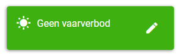
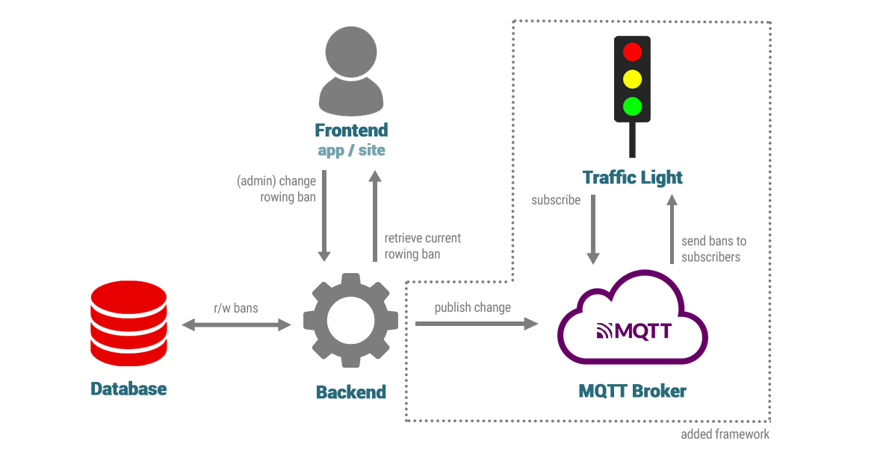

![[traffic-light-1.png]]
In this series of blogposts we will create a smart traffic light. This first post is about creating a simple IoT network to be able to hook up the traffic light to. Then we'll create a simple [proof of concept](traffic-light-2.md). Finally we'll build a [full-size version](traffic-light-3.md) of our traffic light.

# Background

Currently, I'm a member of the _Webcie_ of student rowing club [A.U.S.R. Orca](http://orcaroeien.nl). This committee is responsible for building and maintaining all of Orca's websites, especially the _Member Portal_ [^1] we built from scratch. A cool feature of the portal is the ability for admins to broadcast whether it is allowed to row: the so-called _vaarverbod_ (we'll use its rather mediocre translation 'rowing ban'). Reasons for a ban could be frost, strong wind or an official event like a general members meeting. This feature is useful for rowers who are now able to check whether they're allowed to row _prior_ to heading to the club. They can have a look at the website or the dedicated Orca-app, which share the same backend.

The type of bans can be displayed using a traffic light:

- Green indicates no rowing ban;
- Orange indicates a partial rowing ban, e.g. only 1x's are allowed to row;
- Red indicates a full rowing ban: nobody's allowed to row.


<figure>
  
  <figcaption><center><small>Fig 1. The website displaying 'No rowing ban'. The pencil icon is visible because I'm logged in as admin.</center></small></figcaption>
</figure>

The idea is simple: let the ban automatically be displayed by a traffic light! A full-size traffic light would definitely be an eyecatcher. How are we about to do such a thing?

# IoT Network

We need to have an infrastructure that makes it possible for devices to communicate. In my case it facilitates communication between the backend of the website (member portal) and the traffic light. The protocol we'll be using is [MQTT](https://en.wikipedia.org/wiki/MQTT), or Message Queuing Telemetry Transport. It's really fit to do the job, since it's a lightweight protocol that is publish-subscription based; you won't have to poll every few minutes to see if there's an update. It's widely used for this kind of application, just like [Zigbee](https://en.wikipedia.org/wiki/Zigbee) / [Z-wave](https://en.wikipedia.org/wiki/Z-Wave). We won't use the latter protocols because those require an additional bridge. MQTT just runs over TC/IP which is more practical for our use case.

## MQTT

MQTT basically boils down to a single server (_broker_) that handles all the communication between a number of devices (_clients_) that are connected to the broker. Diagram 1 is a simple overview of all the entities in the network.

<figure>
  
  <figcaption><center><small>Fig 2. Schematic overview of the network.</small></center></figcaption>
</figure>

**Backend**, **Database** and **Frontend** are all components of the previously mentioned member portal. The user (admin) activates a certain rowing ban by pushing a button on the frontend. This triggers an action on the backend, adding the new ban to the database. The frontend now displays the new ban that is stored in the database. These components are specific to the Orca use case and could be replaced by any other system.

Note that **Traffic Light** and **Backend** are both clients that are connected to the broker. The information hierarchy is based on _topics_, which you can imagine to be like 'channels'. A message can only be published into a specified topic. To be able to receive those messages, the client must _subscribe_ to the topic the message is published to. If the backend would publish to `bans/status` and the traffic light would (only) subscribe to `bans/connection`, no message would be retrieved. It is possible to use wildcards while subscribing; the traffic light would receive the message sent by the backend if it'd subscribe to `bans/#` .

Another important feature of the MQTT protocol is the option to _retain_ a message. If a message is retained, it is saved by the broker until it is overwritten. If a new client subscribes to a topic the saved messages would be delivered immediately, which is ideal for rowing bans. Otherwise the device would only be able to detect the rowing ban the moment it changes.

## Broker

The very first thing we need is an MQTT broker. There are excellent free solutions available. I've always used [CloudMQTT](https://www.cloudmqtt.com/) for experimenting, but they recently shut down their free plans (cheapest plan is now $5 per month). [MyQttHub](https://myqtthub.com/en/), [HiveMQ](https://www.hivemq.com/public-mqtt-broker/) and [Flespi](https://flespi.com/mqtt-broker) look promising, although I've never used any of them. For this project I set up my own [Mosquitto](https://mosquitto.org/) broker, which is fairly easy to do but requires some configuration and of course your own server.

## Access Control List (ACL)

The traffic light is supposed to react to the current rowing ban, so we'll need a topic for that: `vvb/status`. It's also nice to know whether the device is up and running, so we'll throw in another topic for that: `connection/stoplicht`.

It's recommended to require credentials for clients to be able to login. Let's create three accounts: **webmaster**, which serves as a personal admin account[^2], **ledenportaal**, which wil be used by the member portal, and **orca**, the account which will be used by our traffic light.

In order to restrict the accounts we create an ACL file, like the one below. [This blogpost](http://www.steves-internet-guide.com/topic-restriction-mosquitto-configuration/) explains ACL for Mosquitto more thoroughly.

```plain
# admin account
user webmaster
topic readwrite #

# account for member portal
user ledenportaal
topic readwrite vvb/status

# account for clients that display ban, such as traffic light
user orca
topic read vvb/status
topic write connection/#
```

## Publishing the rowing ban

Our member portal's backend is built with ASP.NET Core. With the [MQTTnet](https://github.com/chkr1011/MQTTnet) library it was fairly easy to connect to the broker and publish the new ban every time it changed.

Remember, you could take anything as input for your traffic light! For example, the current rowing ban of your own sports club, [kanikeenkortebroekaan.nl](https://www.kanikeenkortebroekaan.nl/), or just hook it up to your own smart home network. You'll just need a client that publishes it to your broker. [Node-RED](https://nodered.org/) is for example very suited to automatically generate messages, using its dedicated [MQTT nodes](https://cookbook.nodered.org/mqtt/connect-to-broker).

# Conclusion

Now we have the required infrastructure to build our own interactive traffic light! To summarize:

- An MQTT broker, either on your own server or a (free) alternative;
- A client (in our case the member portal) that provides us with the current rowing ban;
- Credentials for accessing the broker, restricted to the correct topics.

In the next blogpost we'll build our traffic light prototype!

[^1]: The member portal, located at [mijn.orcaroeien.nl](http://mijn.orcaroeien.nl), is a private website for members of the club. It's used for boat reservations, articles et cetera.
[^2]: With software like [MQTT.fx](https://mqttfx.jensd.de/) it's really easy to send test messages and have an overview of the traffic that goes through your broker.