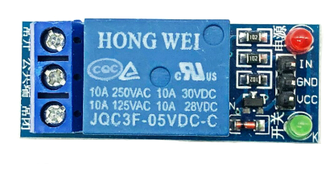
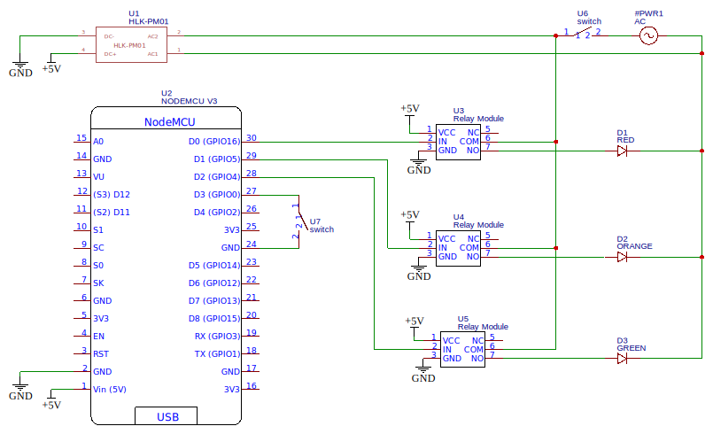
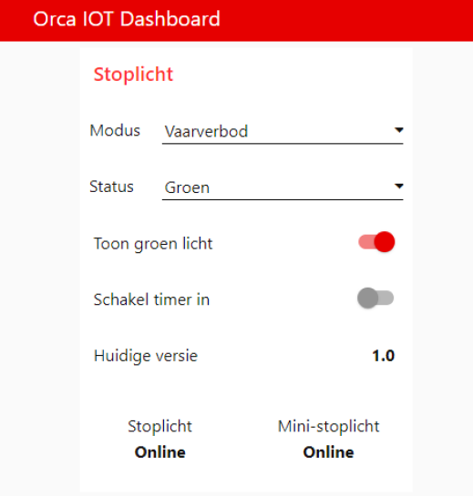

![[traffic-light-3.png]]
We have set up an [IoT Framework](traffic-light-1.md) and created a [prototype traffic light](traffic-light-2.md). Now it's time to build a full-size traffic light that displays the current rowing ban issued by our rowing club (for background, read the [first blogpost](traffic-light-1.md)).

Additional to the features of the prototype, this version will be able to display various animations, such as a party mode. The traffic light should be easily operated through a web app. Another feature we'll add is a button, so the traffic light can also be controlled manually.

# Hardware

We need the following parts:

- 1x Traffic light
- 1x [NodeMCU V3](https://nl.aliexpress.com/item/4000055280006.html?spm=a2g0o.productlist.0.0.5fb27b5eqfQS0w&algo_pvid=eeaf6df4-1304-4ea3-93f4-7bd7a1bd0821&algo_expid=eeaf6df4-1304-4ea3-93f4-7bd7a1bd0821-4&btsid=2100bb4716069226083718443e9783&ws_ab_test=searchweb0_0,searchweb201602_,searchweb201603_) (or something similar)
- 3x [Relay module](https://nl.aliexpress.com/item/4000956019162.html?spm=a2g0o.productlist.0.0.2027ed13Gypgji&algo_pvid=965a5a84-71f7-494c-bc74-b3beef7ead3e&algo_expid=965a5a84-71f7-494c-bc74-b3beef7ead3e-3&btsid=2100bb4716069228422712620e9783&ws_ab_test=searchweb0_0,searchweb201602_,searchweb201603_)
- 1x [HLK-](https://nl.aliexpress.com/item/32913206596.html?spm=a2g0o.productlist.0.0.3be857fbaqNHsK&algo_pvid=998e3861-2cac-462b-9c8c-1fa4d5f14af7&algo_expid=998e3861-2cac-462b-9c8c-1fa4d5f14af7-9&btsid=2100bb4716069229904474704e9783&ws_ab_test=searchweb0_0,searchweb201602_,searchweb201603_)[P](https://nl.aliexpress.com/item/32913206596.html?spm=a2g0o.productlist.0.0.3be857fbaqNHsK&algo_pvid=998e3861-2cac-462b-9c8c-1fa4d5f14af7&algo_expid=998e3861-2cac-462b-9c8c-1fa4d5f14af7-9&btsid=2100bb4716069229904474704e9783&ws_ab_test=searchweb0_0,searchweb201602_,searchweb201603_)[M01 AC-DC Power supply](https://nl.aliexpress.com/item/32913206596.html?spm=a2g0o.productlist.0.0.3be857fbaqNHsK&algo_pvid=998e3861-2cac-462b-9c8c-1fa4d5f14af7&algo_expid=998e3861-2cac-462b-9c8c-1fa4d5f14af7-9&btsid=2100bb4716069229904474704e9783&ws_ab_test=searchweb0_0,searchweb201602_,searchweb201603_)
- 1x Push button
- 1x Power switch
- 1x Junction box
- 1x Installation wire

I bought a full size traffic light via [Marktplaats](https://www.marktplaats.nl/) (similar to Ebay) for €110. After a few days it arrived. I replaced the light bulbs with LEDs and voilà! It was alive!


<figure >
	
	
	<figcaption><center><small>Fig 1. The Traffic Light.</center></small></figcaption>
</figure>
You'll probably find that the lights of your traffic light are wired in such a way that all lights turn on when you give it power.

## Controlling the lights

To be able to have some control over the individual lights instead of them all turning on at once, we need to add a microcontroller. It's all very similar to the way we designed our [prototype](https://joszuijderwijk.nl/smart-traffic-light-2/). However, instead of addressing our LEDs directly, we'll be using a relay.

The relay module we use accepts an input (0V LOW - 5V HIGH) that is sent by our microcontroller. If you pull the input pin (**IN**) high, the terminals **NO** (normaly open) and **COM** (common) will be connected, while **COM** and **NC** (normally closed) will be connected if the input pin is low. The labels on the PCB might be in Chinese (see Figure 2) so make sure you use a multimeter to check the terminals.

<figure>
  
  <figcaption><center><small>Fig 2. The relay module.</center></small></figcaption>
</figure>

We'll connect everything according to the wiring diagram below. Note that I also included the power switch and the control button.

<figure>
  
  <figcaption><center><small>Fig 3. Wiring diagram.</center></small></figcaption>
</figure>

## Wiring up the relay

Let's first make the small connections. I wanted to have the NodeMCU and the relay boards all on one board. The male header pins of the relay boards faced upwards. So I desoldered them and reinstalled them the other way around.


<center>
<video style="width:33%" controls>
  <source src="../../imgs/relay.mp4" type="video/mp4">
  Your browser does not support the video tag.
</video>
</center>
<figcaption><center><small>Video 1. Loose connections on the relay module.</center></small></figcaption>

Somehow that didn't go well. The new pins didn't work and I practically ruined all of my relay boards. Since I didn't want to wait for new ones, I decided to get rid of all of the control logic on the module and recreate it myself. For that purpose I used a standard BC547 transistor with a 1K ohm resistor and a 1N4007 flyback diode.

I made it unnecessarily difficult for myself in the first place by insisting on placing all the components on one board. It's a whole lot easier to just glue the relay boards directly into the junction box.

But now I couldn't go back, so I glued the relay components to the board. The final result looked like this:

<figure >
	
	
	<figcaption><center><small>Fig. 4. The relay boards are wired up.</center></small></figcaption>
</figure>

<center>
<video style="width:25%" controls>
  <source src="../../imgs/testing-relay.mp4" type="video/mp4">
  Your browser does not support the video tag.
</video>
</center>
<figcaption><center><small>Video 2. Testing the circuit.</center></small></figcaption>

The push button is connected to a GPIO and GND. Using the internal pull-up (this is done in code), we can detect whether it is pressed.

## Wiring up the lights
While I was working on the relay boards, my friend Marte wired up the lights according to the schematic in [Figure 3](#fig3)

We inserted the microcontroller into the junction box. It was a bit of a hassle to screw all of the installation wires into the terminals because of the lack of space left in the junction box.

<figure >
	
	
	<figcaption><center><small>Fig.5 : All of the electonics inside the traffic light.</center></small></figcaption>
</figure>As you can see, the Hi-Link AC-DC module is placed outside of the box. This is definitely not the ideal way to attach the module to the case, but the traffic light is not intended for outdoor use anyway.

Aaaaaaaaand it works! Admittedly not after one try... I accidently swapped the green and the red light, so I had to fix that programmatically.

<center>
<video style="width:33%" controls>
  <source src="../../imgs/WhatsApp-Video-2021-01-22-at-19.36.19.mp4" type="video/mp4">
  Your browser does not support the video tag.
</video>
</center>
<figcaption><center><small>Video 3. It's alive!</center></small></figcaption>

# Software

Now we got the hardware part out of the way, we still need software to drive the traffic light.

> 💡**Source:**  The source code for this project is publicly accesible via [GitHub](https://github.com/iovidius/smart-traffic-light/blob/main/stoplicht.ino).

The traffic light has the following features:

- Show the current rowing ban
    - In rowing ban mode, turn on or off the green light, since this light will be on 90% of the time
- Show different animations
- Manual control (i.e. switch modes)
- Remote control
- Firmware updates over the air
- WiFi configuration (through [WiFiManager](http://wifimanager/))
- Turn on or off according to a time scheme

I already discussed and implemented some of these feature in the prototype (MQTT connection, WiFi manager, some animations). In this post I'll focus on the new features.

## Animations

Since the traffic light is placed inside, I thought it'd be cool to add some animation effects so that it could be used while partying or as a decorative light. I included the following animations (see [Video 4](#video4)):

- Party mode (a flashy animation)
- Random mode (lights turn on and off randomly]
- Off mode (all lights are off)
- On mode (all lights are on)

I implemented the animations as a nested array of booleans, each representing the state of one light. The _random_ animation is implemented the following way:

```c
void randomAnimation(){
  int r = random(8) + 1;
  setLights(r % 2, r % 3, r % 4);
}
```

Note that in the implementation above at least one light is always on.

## Manual control

On the side of the traffic light, I added a big red push button. This button makes it possible for a user to interact with the traffic light. The software differentiates between _short_ and _long_ button presses.

A short button press toggles the `showGreen` state. This flag determines whether the green light is shown in 'rowing ban mode'.

A long button press will bring the device in 'animation mode' in which the user can navigate through the animation using short button presses. When arriving at the last animation (ON), the user will be taken back to 'rowing ban mode'.

## Remote control

With [Node-RED](https://nodered.org/) I built a simple dashboard, which makes remote access from anywhere in the world possible.

<figure>
  
  <figcaption><center><small>Fig 6. Dashboard</center></small></figcaption>
</figure>

This is also where I added the timer. In Node-RED it's very simple to add this functionality. It's generally a good idea to make your devices modular, i.e. accepting input / providing output to be able to add another layer of logic afterwards.

## OTA Updates

Taking apart the whole thing for a software update is a very tedious task. Luckily we have Over The Air (OTA) updates. This practically means that you can upload new firmware through WiFi to your microcontroller.

For that purpose, I used [this Node-RED flow](https://flows.nodered.org/flow/888b4cd95250197eb429b2f40d188185) (modified) together with [this library](https://github.com/esp8266/Arduino/blob/master/libraries/ESP8266httpUpdate/src/ESP8266httpUpdate.h). The latter makes it possible to send a HTTP request to an update server (our Node-RED server!) to ask whether an update is available. It sends its current firmware version that is hardcoded. If the server version is higher, the server will respond with the firmware update. Note that the [WiFiClientSecure](https://github.com/espressif/arduino-esp32/tree/master/libraries/WiFiClientSecure) library is needed when requesting updates from a HTTPS server.

Now, to be able to update OTA, you have to trigger the update check. I added an MQTT topic (`vvb/update`) that leads to the device checking for updates whenever a message is sent to it.

I added the logic for checking the right name of the firmware and the MQTT topic that serves as the update topic (this could also be achieved by specifying the firmware name into a single, defined update topic). This makes it possible to update multiple devices running different firmware. Note that it is also possible to update multiple devices running the same firmware. The JSON file below is an example of a configuration file that I use for the OTA system.

```json
{
   "settings":[
      {
         "name":"stoplicht",
         "topic":"vvb/update",
         "latest":{
            "version":"1.0",
            "file":"/data/firmware/stoplicht/stoplicht_1.0.bin"
         }
      }
   ]
}
```

So, if you want to roll out a firmware update, it's as easy as doing the following steps:

1. Compile the source code to a .bin file
2. Upload the .bin file to the destined folder on your server
3. Edit the JSON file and also upload it to your server
4. Trigger the updater of the traffic light

Steps 2 and 3 could be automated by adding a file uploader to the update system. The full flow is included below.

```json
[{"id":"e9377d19.816dc","type":"http in","z":"f6336577.1bc9f8","name":"Receive Update Request","url":"update","method":"get","upload":false,"swaggerDoc":"","x":130,"y":320,"wires":[["8551578f.8af5d8","a1ae8f2d.f63a1"]]},{"id":"30fd7c07.857824","type":"mqtt out","z":"f6336577.1bc9f8","name":"Update message","topic":"","qos":"1","retain":"true","broker":"e7ca3249.6ee4f","x":1070,"y":200,"wires":[]},{"id":"44277341.eff32c","type":"inject","z":"f6336577.1bc9f8","name":"Trigger update","props":[{"p":"name","v":"stoplicht","vt":"str"}],"repeat":"","crontab":"","once":false,"onceDelay":0.1,"topic":"","x":120,"y":160,"wires":[["eb57067c.d5d248"]]},{"id":"8551578f.8af5d8","type":"switch","z":"f6336577.1bc9f8","name":"Check user agent","property":"req.headers.user-agent","propertyType":"msg","rules":[{"t":"neq","v":"ESP8266-http-Update","vt":"str"},{"t":"else"}],"checkall":"false","repair":false,"outputs":2,"x":390,"y":320,"wires":[["68f30d59.fc2a84"],["ff42fb92.516148"]]},{"id":"68f30d59.fc2a84","type":"change","z":"f6336577.1bc9f8","name":"Forbidden","rules":[{"t":"set","p":"statusCode","pt":"msg","to":"403","tot":"str"},{"t":"set","p":"payload","pt":"msg","to":"Forbidden","tot":"str"}],"action":"","property":"","from":"","to":"","reg":false,"x":1040,"y":320,"wires":[["132eb487.bc16fb"]]},{"id":"132eb487.bc16fb","type":"http response","z":"f6336577.1bc9f8","name":"Response","statusCode":"","headers":{},"x":1340,"y":360,"wires":[]},{"id":"ee2df76.ef08808","type":"change","z":"f6336577.1bc9f8","name":"No Update","rules":[{"t":"set","p":"statusCode","pt":"msg","to":"304","tot":"str"}],"action":"","property":"","from":"","to":"","reg":false,"x":1050,"y":360,"wires":[["132eb487.bc16fb"]]},{"id":"9894e289.9dab4","type":"file in","z":"f6336577.1bc9f8","name":"Load Firmware","filename":"","format":"","sendError":false,"x":1000,"y":500,"wires":[["b4cc75ad.14d338"]]},{"id":"70aba325.bf515c","type":"catch","z":"f6336577.1bc9f8","name":"File error","scope":["9894e289.9dab4"],"uncaught":false,"x":1040,"y":420,"wires":[["1b28cf87.fcf9e","ee2df76.ef08808"]]},{"id":"1b28cf87.fcf9e","type":"debug","z":"f6336577.1bc9f8","name":"Firmware file error","active":true,"tosidebar":true,"console":false,"tostatus":false,"complete":"error","targetType":"msg","statusVal":"","statusType":"auto","x":1370,"y":440,"wires":[]},{"id":"ff42fb92.516148","type":"file in","z":"f6336577.1bc9f8","name":"Load settings","filename":"/data/firmware/settings.json","format":"utf8","sendError":false,"x":490,"y":400,"wires":[["d019f6b2.34a7a8"]]},{"id":"d019f6b2.34a7a8","type":"json","z":"f6336577.1bc9f8","name":"","property":"payload","action":"","pretty":false,"x":630,"y":400,"wires":[["452789ce.c201f8"]]},{"id":"eb57067c.d5d248","type":"file in","z":"f6336577.1bc9f8","name":"Load settings","filename":"/data/firmware/settings.json","format":"utf8","sendError":false,"x":290,"y":160,"wires":[["a0ecf9f0.626ef8"]]},{"id":"a0ecf9f0.626ef8","type":"json","z":"f6336577.1bc9f8","name":"","property":"payload","action":"","pretty":false,"x":430,"y":160,"wires":[["e165242f.f922f8"]]},{"id":"8f069645.1a3b58","type":"comment","z":"f6336577.1bc9f8","name":"","info":"Vergeet niet in te stellen welke firmware er moet worden geüpdatet!\n\nNeem bij vragen contact op met [Jos Zuijderwijk](mailto:hoi@joszuijderwijk.nl).","x":110,"y":120,"wires":[]},{"id":"e165242f.f922f8","type":"function","z":"f6336577.1bc9f8","name":"find fw data","func":"for (var i in msg.payload.settings){\n var item = msg.payload.settings[i]\n if (item.name == msg.name){\n msg.payload = item;\n return msg;\n }\n}\n\n// not found! error\nmsg.payload = \"404\";\nreturn msg;","outputs":1,"noerr":0,"initialize":"","finalize":"","x":590,"y":160,"wires":[["f1531d6a.0657d"]]},{"id":"f1531d6a.0657d","type":"switch","z":"f6336577.1bc9f8","name":"found?","property":"payload","propertyType":"msg","rules":[{"t":"eq","v":"404","vt":"str"},{"t":"else"}],"checkall":"true","repair":false,"outputs":2,"x":730,"y":160,"wires":[["cc91223e.9aec2"],["baa0a8e0.734d98"]]},{"id":"cc91223e.9aec2","type":"debug","z":"f6336577.1bc9f8","name":"Not found!","active":false,"tosidebar":true,"console":false,"tostatus":false,"complete":"true","targetType":"full","statusVal":"","statusType":"auto","x":890,"y":120,"wires":[]},{"id":"baa0a8e0.734d98","type":"change","z":"f6336577.1bc9f8","name":"","rules":[{"t":"set","p":"topic","pt":"msg","to":"payload.topic","tot":"msg"},{"t":"set","p":"payload","pt":"msg","to":"payload.latest.version","tot":"msg"}],"action":"","property":"","from":"","to":"","reg":false,"x":880,"y":200,"wires":[["30fd7c07.857824"]]},{"id":"452789ce.c201f8","type":"function","z":"f6336577.1bc9f8","name":"check fw data","func":"var fw = JSON.parse(msg.req.headers[\"x-esp8266-version\"]);\n\nfor (var i in msg.payload.settings){\n var item = msg.payload.settings[i]\n if (item.name == fw.name){\n \n //check version\n if (item.version == fw.version){\n msg.payload = \"304\";\n return msg;\n }else{\n msg.filename = item.latest.file;\n msg.req = fw;\n return msg;\n }\n\n }\n}\n\n// not found! error\nmsg.payload = \"404\";\nreturn msg;","outputs":1,"noerr":0,"initialize":"","finalize":"","x":620,"y":460,"wires":[["6664c2.0ab02b4"]]},{"id":"6664c2.0ab02b4","type":"switch","z":"f6336577.1bc9f8","name":"check version","property":"payload","propertyType":"msg","rules":[{"t":"eq","v":"404","vt":"str"},{"t":"eq","v":"304","vt":"str"},{"t":"else"}],"checkall":"true","repair":false,"outputs":3,"x":840,"y":400,"wires":[["ee2df76.ef08808"],["ee2df76.ef08808"],["9894e289.9dab4"]]},{"id":"b4cc75ad.14d338","type":"change","z":"f6336577.1bc9f8","name":"Update!","rules":[{"t":"set","p":"statusCode","pt":"msg","to":"200","tot":"str"}],"action":"","property":"","from":"","to":"","reg":false,"x":1160,"y":500,"wires":[["132eb487.bc16fb"]]},{"id":"a1ae8f2d.f63a1","type":"debug","z":"f6336577.1bc9f8","name":"","active":true,"tosidebar":true,"console":false,"tostatus":false,"complete":"true","targetType":"full","statusVal":"","statusType":"auto","x":340,"y":260,"wires":[]},{"id":"e7ca3249.6ee4f","type":"mqtt-broker","name":"Orca Broker","broker":"mqtt.orcaroeien.nl","port":"1883","clientid":"Orca IOT","usetls":false,"compatmode":false,"keepalive":"60","cleansession":true,"birthTopic":"","birthQos":"0","birthPayload":"","closeTopic":"","closeQos":"0","closePayload":"","willTopic":"","willQos":"0","willPayload":""}]
```

# Result

<center>
<iframe id="video4" width="560" height="315" src="https://www.youtube.com/embed/0nWFojlPRRk" frameborder="0" allowfullscreen></iframe>

</center>
<figcaption><center><small>Video 4. Demo of Party Mode / Random Mode.</center></small></figcaption>